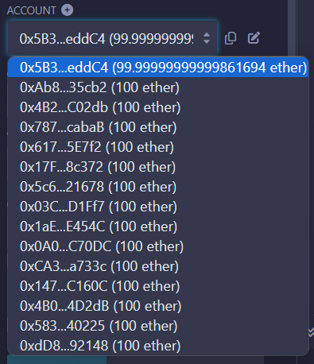
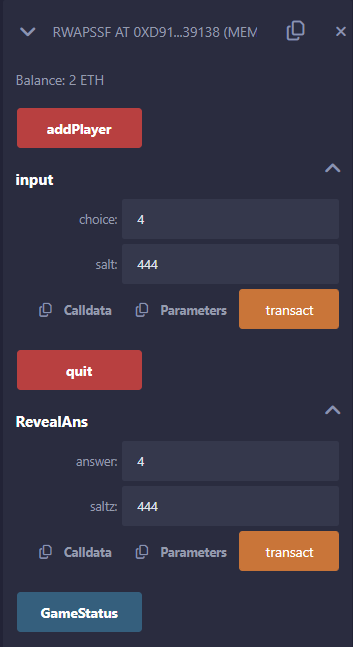

# RWAPSSF  
## Contract
เปลี่ยน variable ต่างๆที่ไม่มีการเรียกใช้ของ player เป็น internal เพื่อป้องกันช่องโหว่จากการเป็น public variable    
```
uint internal numPlayer = 0;
uint internal reward = 0;
uint internal numInput = 0;
```    
สร้าง mapping (address => uint) private PlayerIndex; เพื่อไม่จำเป็นต้องรู้ index ตัวเอง ก็สามารถลงเงินได้

```
mapping (address => uint) private PlayerIndex;
```
สร้าง choose_timelimit เพื่อทำการกำหนดเวลาที่ใช้ในการเลือกคำตอบ
```
uint internal choose_timelimit = 10 minutes;
```
ทำการเปลี่ยนชื่อ contract เป็น RWAPSSF เพื่อรองรับกับการเล่นที่มากขึ้น
```
contract RWAPSSF{
    ...
}
```
ทำการ import CommitReveal เพื่อนำมาเป็น Parent
```
import "./CommitReveal.sol";

contract RWAPSSF is CommitReveal{
    ...
}
```

## Struct
### ทำการสร้าง 2 ค่าใหม่ดังนี้
ทำการสร้าง timestamp โดยให้ผู้เล่นทุกคนมี timestamp ที่เกิดขึ้น  
```
uint timestamp;
```
ทำการสร้าง foul เพื่อบอกว่าผู้เล่นทำตามกติกาหรือไม่ โดยให้เวลาเลือกคำตอบเป็น 5 นาที
```
bool foul;
```
## Function
### Function ที่สร้างขึ้นมาใหม่
#### _reset()
สร้าง _reset()  เพื่อแก้ปัญหาที่ต้อง deploy ใหม่ตลอด โดยทำการ reset ทุกอย่างใน contract ให้เหมือนกับการเล่นครั้งแรก
```
function _reset() private{
    numPlayer = 0;
    reward = 0;
    numInput = 0;
    for(uint i=0;i<2;i++){
        PlayerIndex[player[i].addr] = 0;
        player[i].addr = address(0);
        player[i].choice = 7;
        player[i].timestamp = block.timestamp;
        player[i].foul = false;
    }
}
```
#### _terminate()
สร้าง _terminate() สำหรับการจัดการผู้ที่ไม่ทำตามกติกา และมอบรางวัลให้แก่ผู้เล่นที่ทำตามกติกา หากผิดทั้งคู่ถือว่าเกมนั้นเป็นโมฆะและแจกรางวัลคืนแก่ทั้งสองฝ่าย
```
function _terminate() private {
    if(player[0].foul==true){
        payable(player[1].addr).transfer(reward);
    }
    else if(player[1].foul==true){
        payable(player[0].addr).transfer(reward);
    }
    else{
        payable(player[0].addr).transfer(reward/2);
        payable(player[1].addr).transfer(reward/2);
    }
    _reset();
}
```
#### quit()   
สร้าง quit() ในกรณีที่ผู้เล่นอีกคนไม่ยอมเลือกคำตอบสักที โดยจะถือว่าเกมนั้นเป็นโมฆะและแจกรางวัลคืนแก่ทั้งสองฝ่าย
```
function quit() public payable {
    uint idx = PlayerIndex[msg.sender];
    require(numPlayer == 1 || numInput < 2);
    if (numPlayer == 1) {
        payable(player[idx].addr).transfer(reward);
    } else {
        payable(player[0].addr).transfer(reward/2);
        payable(player[1].addr).transfer(reward/2);
    }
    _reset();
}
```
#### RevealAns (uint answer, uint saltz) 
สร้าง function ที่ทำหน้าที่ให้เกิดการคำนวณผลแพ้ชนะจากการเปิดเผยผลเฉลย ซึ่งจะสามารถเรียกได้เมื่อผู้เล่นทั้งสองได้ทำการเลือกคำตอบแล้ว เพื่อป้องกันการ front-running
```
function RevealAns(uint answer,uint saltz) public{
    require(numInput == 2);
    revealAnswer(bytes32(answer),bytes32(saltz));
    uint idx = PlayerIndex[msg.sender];
    player[idx].choice = answer;
    if(commits[player[0].addr].revealed==true && commits[player[1].addr].revealed==true){
        _checkWinnerAndPay();
    }
}
```  
### Function ที่ทำการแก้ไข
#### input()   
-สร้างเงื่อนไขที่ทำให้ foul  
-ใช้การ mapping ด้วย PlayerIndex  
-ทำการ Hashed และ Commit
-เปลี่ยนงื่อนไขให้รองรับ RWAPSSF
```
function input(uint choice, uint salt) public{
    uint idx = PlayerIndex[msg.sender];
    require(numPlayer == 2);
    require(msg.sender == player[idx].addr);
    require(choice == 0 || choice == 1 || choice == 2 || choice == 3 || choice == 4 || choice == 5 || choice == 6);
    if(block.timestamp > player[idx].timestamp + choose_timelimit){
        player[idx].foul = true;
    }
    uint HashedData = uint(getSaltedHash(bytes32(choice),bytes32(salt)));
    player[idx].choice = HashedData;
    commit(bytes32(HashedData));
    numInput++;
}
```
#### addplayer()
ทำการระบุ timestamp เมื่อผู้เล่นทั้งสองพร้อมเลือกคำตอบ
```
function addPlayer() public payable {
    require(numPlayer < 2);
    require(msg.value == 1 ether);
    reward += msg.value;
    player[numPlayer].addr = msg.sender;
    player[numPlayer].choice = 7;
    player[numPlayer].foul = false;
    PlayerIndex[msg.sender] = numPlayer;
    numPlayer++;
    if (numPlayer == 2) {
        player[0].timestamp = block.timestamp;
        player[1].timestamp = block.timestamp;
    }
}
```
#### addplayer()
ปรับเงื่อนไขให้รองรับ RWAPSSF พร้อมกับเรียกใช้ _reset() เพื่อเตรียมพร้อมสำหรับเกมรอบใหม่
```
function _checkWinnerAndPay() private {
    uint p0Choice = player[0].choice;
    uint p1Choice = player[1].choice;
    address payable account0 = payable(player[0].addr);
    address payable account1 = payable(player[1].addr);
    if(player[0].foul == true || player[1].foul == true){
        _terminate();
        return;
    }
    if (((p0Choice + 1) % 7 == p1Choice) || ((p0Choice + 2) % 7 == p1Choice) || ((p0Choice + 3) % 7 == p1Choice)) {
        // to pay player[0]
        account0.transfer(reward);
    }
    else if (((p1Choice + 1) % 7 == p0Choice) || ((p1Choice + 2) % 7 == p0Choice) || ((p1Choice + 3) % 7 == p0Choice)) {
        // to pay player[1]
        account1.transfer(reward);    
    }
    else {
        // to split reward
        account0.transfer(reward / 2);
        account1.transfer(reward / 2);
    }
    _reset();
}
```

# CommitReveal
ทำการแก้ไข function ที่ไม่สามารถถูกเรียกโดย user ให้เป็น private และเป็น internal ถ้า function นั้นถูกเรียกโดย RWAPSSF.sol
```
function commit(bytes32 dataHash) internal;
function reveal(bytes32 revealHash) private;
function getHash(bytes32 data) internal view returns(bytes32);
function revealAnswer(bytes32 answer,bytes32 salt) internal;
function getSaltedHash(bytes32 data,bytes32 salt) internal view returns(bytes32);
```

# ตัวอย่าง
## กรณีชนะ


## กรณีแพ้





## กรณีเสมอ


